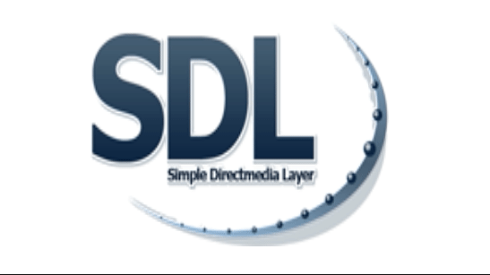
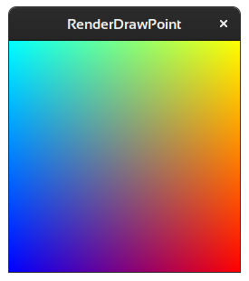
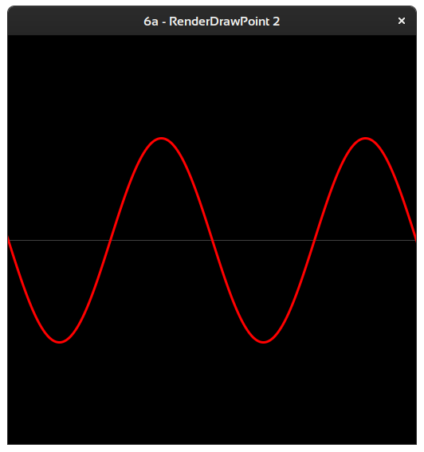
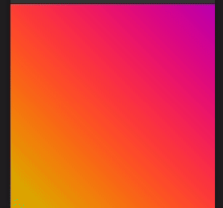

# The SDL2 Renderer

1 Set up a renderer and render a png.

- 1a Scale png via destination rect
  
  

2 Flip png horizontal.

3 Rotate

4 Rotate different Center

5 Saving a screenshot, use key `s`

6 uses `SDL_RenderDrawPoint` to render a gradient.

6a render smooth sine wave

7 resizes the gradient to the window dimensions

8 animates the gradient like a new shadertoy gradient.

6-8 showing a bit how glsl works and why we want shaders.

### Useful links

[SDL2](https://www.libsdl.org/)

[My SDL2 Demo-Collection](https://acry.github.io/SDL2-C.html)

[Contact](https://acry.github.io/#contact)
