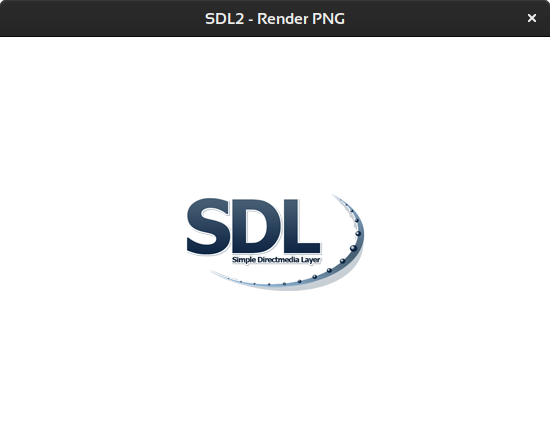
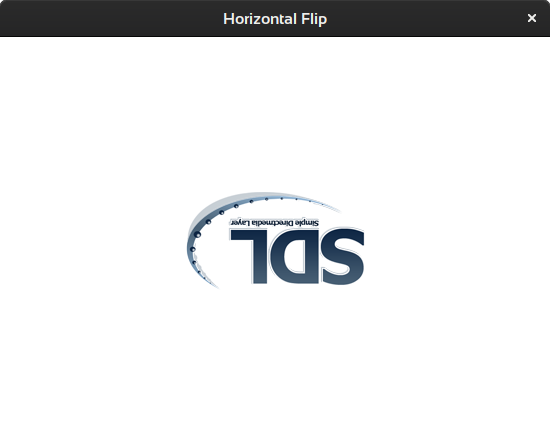

# The SDL2 Renderer

1. Set up a renderer and render a png.
   

2. Flip png horizontal.
   

3.

4.

5.

6. uses `SDL_RenderDrawPoint` to render a gradient.

7. resizes the gradient to the window dimensions

8. animates the gradient like a new shadertoy gradient.

   Shows a bit how glsl works and why we want shaders.

### Useful links

[SDL2](https://www.libsdl.org/)

[My SDL2 Demo-Collection](https://acry.github.io/SDL2-C.html)

[Contact](https://acry.github.io/#contact)
