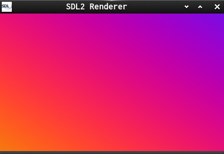
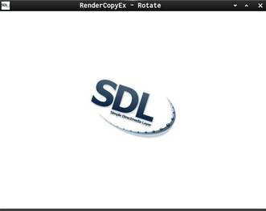

This is a series about the SDL2-Renderer  

  1 - sets up a Renderer and renders a png  
	1a, 1b, 1c using SDL_RenderCopyEx  
  2 - uses SDL_RenderDrawPoint to render a gradient.  
  3 - resizes the gradient to the window dimensions  
  4 - animates the gradient like a new shadertoy gradient.  
      Shows a bit how glsl works and why we want shaders.  

Useful links:  
[SDL2](https://www.libsdl.org/)  [SDL-Discourse](https://discourse.libsdl.org)  [More Example Code](https://gist.github.com/Acry/baa861b8e370c6eddbb18519c487d9d8)

Screenshots:  
  
  
[Get in touch on SDL-Discourse](https://discourse.libsdl.org/u/Acry/summary)  
